# Kubernetes Storage Volumes Lab

<p align="left">
  
  
  
  
  
</p>

Laboratório prático e progressivo para dominar **Storage no Kubernetes** com foco em execução local no **Windows 11**, usando **VS Code**, **CMD/PowerShell**, **Docker Desktop**, **k3d** e **kubectl**.

## Índice

- [Descrição](#descrição)
- [Objetivo de Aprendizado](#objetivo-de-aprendizado)
- [Tecnologias Utilizadas](#tecnologias-utilizadas)
- [Ambiente Recomendado](#ambiente-recomendado)
- [Ambiente Validado](#ambiente-validado)
- [Status da Validação](#status-da-validação)
- [CI/CD](#cicd)
- [Conceitos Abordados](#conceitos-abordados)
- [Arquitetura Lógica](#arquitetura-lógica)
- [Padrões do Projeto](#padrões-do-projeto)
- [Estrutura de Pastas](#estrutura-de-pastas)
- [Checklist de Publicacao](#checklist-de-publicacao)
- [Ordem Recomendada dos Laboratórios](#ordem-recomendada-dos-laboratórios)
- [Matriz dos Laboratórios](#matriz-dos-laboratórios)
- [Comandos Úteis de Verificação](#comandos-úteis-de-verificação)
- [Execução dos Scripts PowerShell](#execução-dos-scripts-powershell)
- [Limpeza dos Recursos](#limpeza-dos-recursos)
- [Troubleshooting](#troubleshooting)
- [Segurança Básica](#segurança-básica)
- [Evidências recomendadas para o portfólio](#evidências-recomendadas-para-o-portfólio)
- [Como publicar este projeto no GitHub](#como-publicar-este-projeto-no-github)
- [Habilidades demonstradas](#habilidades-demonstradas)
- [Conclusão](#conclusão)

## Descrição

O repositório foi desenhado para estudo técnico com qualidade de portfólio, cobrindo desde volumes temporários até governança de storage por namespace.  
Cada laboratório possui manifests e documentação próprios, permitindo execução isolada ou em fluxo completo.

## Objetivo de Aprendizado

Desenvolver domínio prático sobre:

- volumes efêmeros e persistentes;
- `PersistentVolume`, `PersistentVolumeClaim` e `StorageClass`;
- `hostPath`, NFS e provisionamento dinâmico;
- governança de storage com `LimitRange` e `ResourceQuota`;
- `ConfigMap` e `Secret` montados como volume;
- operação local em Windows 11 com scripts PowerShell.

## Tecnologias Utilizadas

- Kubernetes
- kubectl
- Docker Desktop
- k3d (k3s em containers Docker)
- PowerShell
- CMD
- VS Code
- Codex dentro do VS Code
- YAML
- Mermaid

## Ambiente Recomendado

- Windows 11
- VS Code
- Terminal CMD ou PowerShell
- Docker Desktop
- k3d instalado no Windows
- kubectl instalado diretamente no Windows
- Cluster ativo: `k3d-meucluster`
- StorageClass disponível: `local-path`
- Provisioner esperado: `rancher.io/local-path`
- Não há dependência obrigatória de WSL2

Validação rápida:

```powershell
kubectl version --client
kubectl config current-context
kubectl get nodes
kubectl get storageclass
kubectl describe storageclass local-path
docker version
k3d version
```

## Ambiente Validado

Este projeto foi validado em um cluster Kubernetes local com **k3d** rodando sobre **Docker Desktop** no **Windows 11**.

| Item | Valor validado |
|---|---|
| Sistema operacional | Windows 11 |
| Editor | VS Code |
| Terminal | CMD ou PowerShell |
| Container runtime | Docker Desktop |
| Cluster local | k3d |
| Nome do cluster | `k3d-meucluster` |
| Kubernetes | `v1.31.5+k3s1` |
| Quantidade de nodes | 3 servers/control-plane + 3 agents/workers |
| StorageClass padrão | `local-path` |
| Provisioner da StorageClass | `rancher.io/local-path` |

Comandos usados para validar o ambiente:

```powershell
kubectl get nodes
kubectl get pods -A
kubectl get storageclass
```

## Status da Validação

Os principais manifests do projeto passaram nas validações de aplicação em modo de simulação:

```powershell
kubectl apply --dry-run=client -f manifests/01-volume-emptydir
kubectl apply --dry-run=server -f manifests/01-volume-emptydir
```

## CI/CD

Este projeto possui pipeline de validação automática com **GitHub Actions** no workflow:

- `.github/workflows/validate-kubernetes-yaml.yml`

A cada `push` e `pull_request` para `main`, a pipeline:

1. valida sintaxe YAML dos arquivos em `manifests` (`.yaml` e `.yml`);
2. valida manifests Kubernetes por schema com `kubeconform`, sem depender de cluster local.

Observação importante: embora o projeto rode localmente no Windows 11, a validação de CI acontece no ambiente do GitHub Actions usando runner Linux (`ubuntu-latest`), o que é esperado e recomendado para portfólio.

## Conceitos Abordados

- `Volume`
- `emptyDir`
- `hostPath`
- `PersistentVolume (PV)`
- `PersistentVolumeClaim (PVC)`
- `StorageClass`
- `NFS`
- `Dynamic Provisioning`
- `LimitRange`
- `ResourceQuota`
- `ConfigMap` como volume
- `Secret` como volume

## Arquitetura Lógica

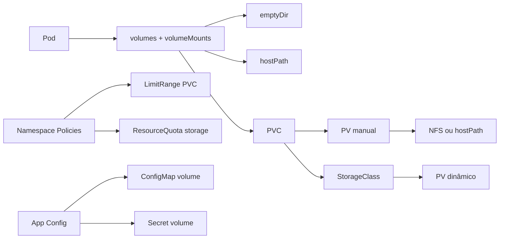

## Padrões do Projeto

### Padrão de namespaces

| Escopo | Namespace |
|---|---|
| Labs 01 a 06 + NFS | `storage-lab` |
| Governança de quota/limite | `storage-lab-quota` |
| ConfigMap/Secret | `storage-lab-config` |

### Padrão de nomes de recursos

| Tipo | Convenção |
|---|---|
| Pod de demonstração | `*-demo` |
| PVC | `pvc-*` |
| PV | `pv-*` |
| Deployments | `*-demo` ou nome funcional |
| Quotas/Limites | nomes descritivos (`storage-limit-range`, `storage-resource-quota`) |

## Estrutura de Pastas

```text
.
├── README.md
├── CHECKLIST.md
├── docs
│   ├── 01-conceitos-storage.md
│   ├── 02-hostpath.md
│   ├── 03-pv-pvc.md
│   ├── 04-nfs-storage.md
│   ├── 05-storageclass-dynamic-provisioning.md
│   ├── 06-limitrange-resourcequota.md
│   └── 07-configmap-secret-volume.md
├── manifests
│   ├── 01-volume-emptydir
│   ├── 02-hostpath
│   ├── 03-pv-pvc
│   ├── 04-nfs-server
│   ├── 05-nfs-volume
│   ├── 06-storageclass
│   ├── 07-limitrange-resourcequota
│   └── 08-configmap-secret-volume
├── scripts
│   ├── apply-all.ps1
│   ├── cleanup-all.ps1
│   ├── check-resources.ps1
│   ├── prepare-nfs-pv.ps1
│   ├── validate-manifests.ps1
│   └── generate-screenshots.ps1
└── screenshots
    └── README.md
```

## Checklist de Publicacao

- Consulte o checklist completo em [CHECKLIST.md](./CHECKLIST.md).

## Ordem Recomendada dos Laboratórios

1. `01-volume-emptydir`
2. `02-hostpath`
3. `03-pv-pvc`
4. `04-nfs-server`
5. `05-nfs-volume`
6. `06-storageclass`
7. `07-limitrange-resourcequota`
8. `08-configmap-secret-volume`

## Matriz dos Laboratórios

| Lab | Tema | Recursos principais | Namespace |
|---|---|---|---|
| 01 | `emptyDir` | Pod multi-container (`writer` + `reader`) | `storage-lab` |
| 02 | `hostPath` | Pod NGINX + initContainer | `storage-lab` |
| 03 | PV/PVC estático | PV `manual` + PVC + Pod | `storage-lab` |
| 04 | Servidor NFS | Deployment + Service NFS | `storage-lab` |
| 05 | PV/PVC com NFS | PV `RWX` + PVC + Deployment 2 réplicas | `storage-lab` |
| 06 | StorageClass dinâmico | PVC dinâmico + Pod consumidor | `storage-lab` |
| 07 | Governança de storage | LimitRange + ResourceQuota + PVCs de teste | `storage-lab-quota` |
| 08 | Configuração segura | ConfigMap volume + Secret volume | `storage-lab-config` |

## Comandos Úteis de Verificação

```powershell
kubectl get nodes
kubectl get pods -A
kubectl get pv
kubectl get pvc -A
kubectl get storageclass
kubectl get ns
kubectl describe pvc pvc-hostpath-demo -n storage-lab
kubectl describe pv pv-hostpath-demo
```

## Execução dos Scripts PowerShell

Se necessário, habilite execução temporária apenas no processo atual:

```powershell
Set-ExecutionPolicy -Scope Process -ExecutionPolicy Bypass
```

Execução do script de verificação no PowerShell:

```powershell
Set-ExecutionPolicy -Scope Process -ExecutionPolicy Bypass
.\scripts\check-resources.ps1
```

Execução do mesmo script via CMD:

```cmd
powershell -ExecutionPolicy Bypass -File .\scripts\check-resources.ps1
```

Fluxo recomendado:

```powershell
.\scripts\apply-all.ps1
.\scripts\validate-manifests.ps1
.\scripts\check-resources.ps1
```

Observação: no Lab 06, o projeto usa `storageClassName: local-path`, alinhado ao cluster `k3d-meucluster` (provisioner `rancher.io/local-path`).

Execução direta do laboratório de provisionamento dinâmico:

```powershell
kubectl get storageclass
kubectl describe storageclass local-path
kubectl apply -f manifests/06-storageclass
kubectl get pvc -n storage-lab
kubectl get pv
```

Observação: em outros ambientes (como Minikube ou Kubernetes do Docker Desktop), o nome da StorageClass pode variar.  
Neste projeto, validado com k3d/k3s, o nome correto é `local-path`.

Script auxiliar do NFS (opcional, quando for aplicar apenas o Lab 05):

```powershell
.\scripts\prepare-nfs-pv.ps1
kubectl apply -f manifests/05-nfs-volume/persistent-volume-nfs.generated.yaml
```

Execução rápida:

```powershell
Set-ExecutionPolicy -Scope Process -ExecutionPolicy Bypass
.\scripts\apply-all.ps1
.\scripts\check-resources.ps1
.\scripts\cleanup-all.ps1
```

Geração automática das evidências em PNG para a pasta `screenshots`:

```powershell
Set-ExecutionPolicy -Scope Process -ExecutionPolicy Bypass
.\scripts\generate-screenshots.ps1
```

## Limpeza dos Recursos

Limpeza completa do projeto:

```powershell
.\scripts\cleanup-all.ps1
```

Limpeza manual (opcional):

```powershell
kubectl delete ns storage-lab storage-lab-quota storage-lab-config --ignore-not-found
kubectl delete pv pv-hostpath-demo pv-nfs-demo --ignore-not-found
```

## Troubleshooting

### 1) `kubectl` não conecta no cluster

```powershell
kubectl config get-contexts
kubectl config current-context
kubectl get nodes
```

Se necessário, selecione o contexto correto:

```powershell
kubectl config use-context k3d-meucluster
```

### 2) PVC em `Pending`

```powershell
kubectl get pvc -A
kubectl describe pvc pvc-dynamic-demo -n storage-lab
kubectl get storageclass
kubectl describe storageclass local-path
```

Valide se `storageClassName: local-path` está disponível no cluster local.

### 3) Erro no laboratório NFS

```powershell
kubectl get pods -n storage-lab -l app=nfs-server
kubectl logs -n storage-lab deployment/nfs-server
kubectl get svc nfs-server -n storage-lab
kubectl describe pod -n storage-lab -l app=nginx-nfs-demo
```

### 4) Script PowerShell bloqueado

```powershell
Set-ExecutionPolicy -Scope Process -ExecutionPolicy Bypass
```

### 5) `hostPath` não aparece no Windows

No cluster local, caminhos como `/tmp/k8s-hostpath-demo` pertencem ao nó Linux interno do Kubernetes, não ao `C:\` diretamente.

## Segurança Básica

- Os exemplos de `Secret` são **didáticos** e usam valores fictícios para laboratório local.
- O projeto não depende de credenciais reais para execução.
- O `.gitignore` bloqueia arquivos sensíveis comuns (`.env`, kubeconfig, chaves e certificados).
- Os erros de `LimitRange` e `ResourceQuota` no Lab 07 são controlados e intencionais para ensino de governança.

## Evidências recomendadas para o portfólio

Use a tabela abaixo para orientar as capturas de tela que comprovam domínio técnico do projeto:

| Evidência | Comando | O que demonstrar no print |
|---|---|---|
| Nodes do cluster | `kubectl get nodes` | Cluster k3d com 3 servers e 3 agents em estado `Ready` |
| Pods de todos os namespaces | `kubectl get pods -A` | Componentes do cluster e workloads em execução |
| StorageClass disponível | `kubectl get storageclass` | StorageClass `local-path` disponível para provisionamento dinâmico |
| PersistentVolumes | `kubectl get pv` | Volumes persistentes criados no cluster |
| PersistentVolumeClaims | `kubectl get pvc -A` | Claims solicitando storage |
| `emptyDir` | `kubectl logs -n storage-lab pod/emptydir-demo -c reader` | Containers compartilhando volume temporário |
| `hostPath` | `kubectl describe pod hostpath-demo -n storage-lab` | Volume montado a partir do nó Kubernetes |
| PVC com `hostPath` | `kubectl exec -n storage-lab pod-pvc-demo -- cat /data/message.txt` | Pod consumindo PVC |
| StorageClass `local-path` | `kubectl describe storageclass local-path` | Provisionamento dinâmico local |
| ConfigMap como volume | `kubectl exec -n storage-lab-config pod-configmap-volume-demo -- ls -l /etc/config` | ConfigMap montado como arquivos |
| Secret como volume | `kubectl exec -n storage-lab-config pod-secret-volume-demo -- ls -l /etc/secret` | Secret montado como arquivos |
| LimitRange | `kubectl describe limitrange storage-limit-range -n storage-lab-quota` | Limites mínimos e máximos para PVC |
| ResourceQuota | `kubectl describe resourcequota storage-resource-quota -n storage-lab-quota` | Controle de consumo total de storage no namespace |

Arquivos de evidência são salvos em [`./screenshots`](./screenshots), seguindo o padrão `01-...png` até `12-...png`.

Comandos base para coletar evidências:

```powershell
kubectl get nodes
kubectl get pv
kubectl get pvc -A
kubectl get storageclass
kubectl describe pvc pvc-hostpath-demo -n storage-lab
kubectl describe pv pv-hostpath-demo
kubectl get pods -A
```

### Evidências por contexto

> Dica de visualização: os prints estão em **tema escuro** e com **fonte ampliada**.  
> Clique em cada imagem para abrir em tamanho real. Em telas menores, use a rolagem horizontal do navegador ao visualizar a imagem ampliada.

#### Contexto 1: Saúde do cluster local (k3d)

Comandos de referência:

```powershell
kubectl get nodes
kubectl get pods -A
kubectl get storageclass
```

[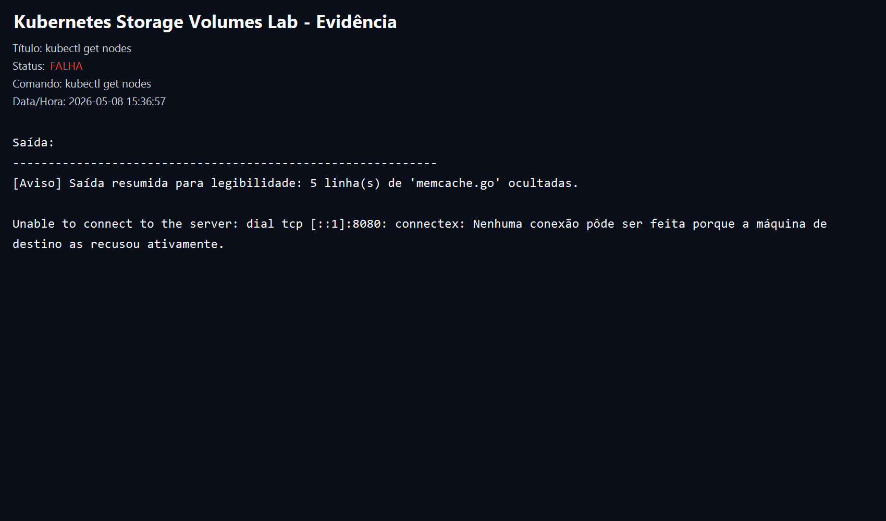](./screenshots/01-kubectl-get-nodes.png)
[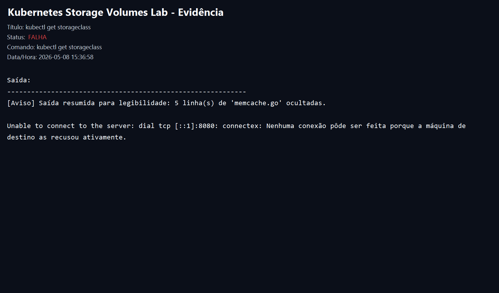](./screenshots/04-kubectl-get-storageclass.png)

#### Contexto 2: Persistência com PV/PVC

Comandos de referência:

```powershell
kubectl get pv
kubectl get pvc -A
kubectl describe pvc pvc-hostpath-demo -n storage-lab
```

[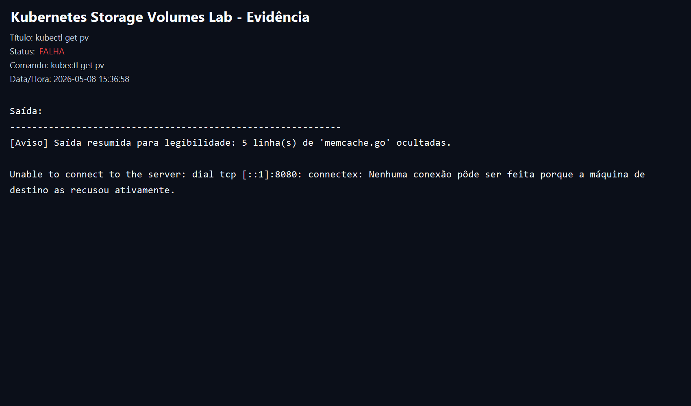](./screenshots/02-kubectl-get-pv.png)
[](./screenshots/03-kubectl-get-pvc-all.png)
[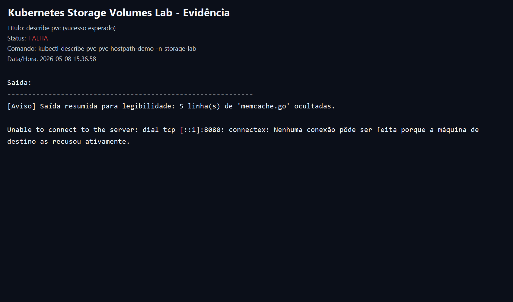](./screenshots/05-describe-pvc-success.png)

#### Contexto 3: Laboratórios de volume (emptyDir, hostPath, NFS)

Comandos de referência:

```powershell
kubectl logs -n storage-lab pod/emptydir-demo -c reader
kubectl describe pod hostpath-demo -n storage-lab
kubectl get pods -n storage-lab -l app=nginx-nfs-demo
```

[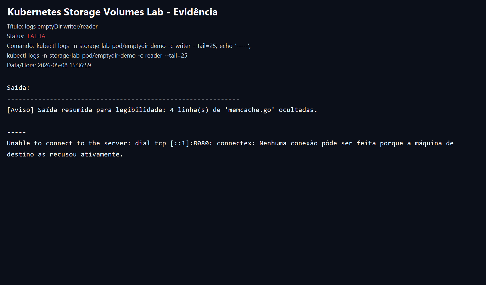](./screenshots/07-emptydir-logs.png)
[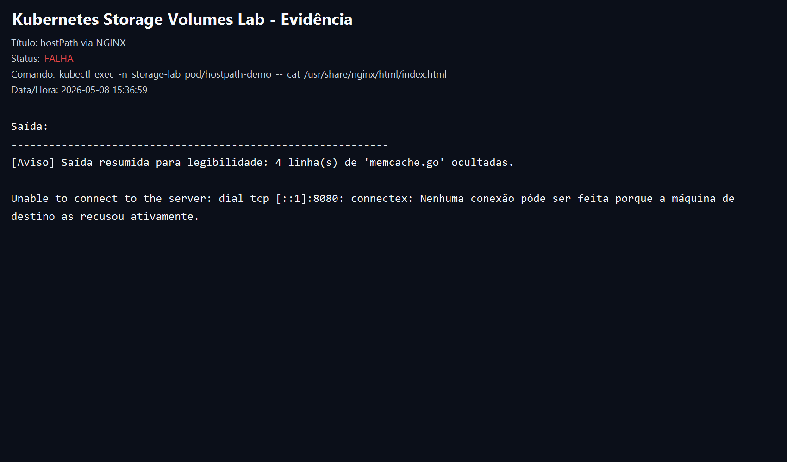](./screenshots/08-hostpath-http.png)
[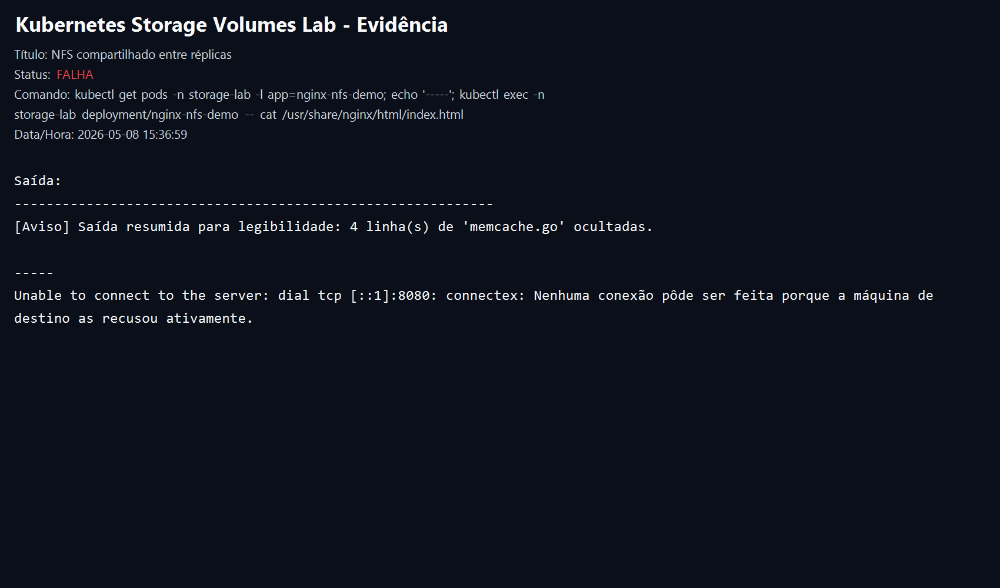](./screenshots/09-nfs-shared-content.png)

#### Contexto 4: Configuração e segurança de aplicação

Comandos de referência:

```powershell
kubectl exec -n storage-lab-config pod-configmap-volume-demo -- ls -l /etc/config
kubectl exec -n storage-lab-config pod-secret-volume-demo -- ls -l /etc/secret
kubectl describe limitrange storage-limit-range -n storage-lab-quota
kubectl describe resourcequota storage-resource-quota -n storage-lab-quota
```

[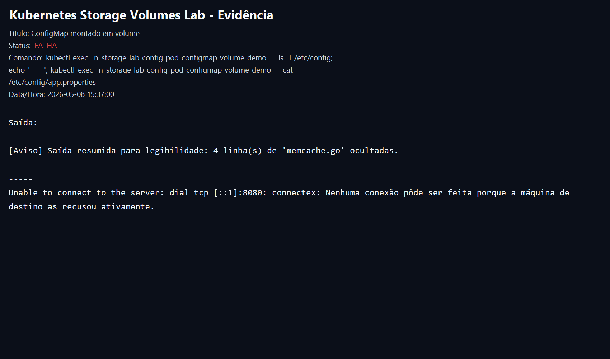](./screenshots/10-configmap-volume.png)
[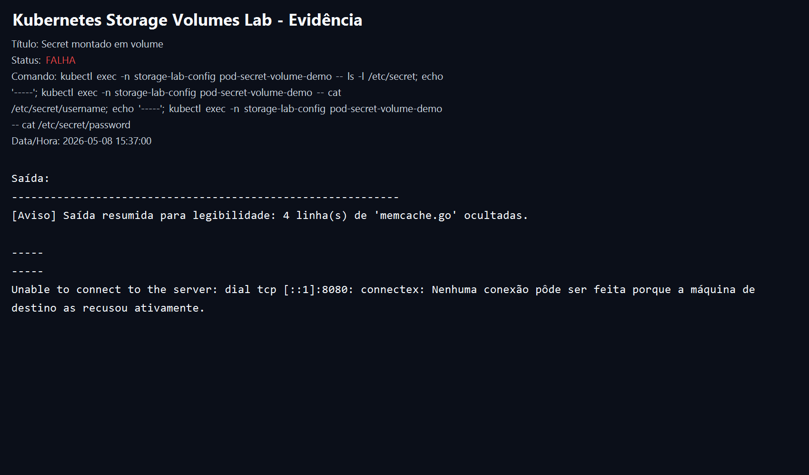](./screenshots/11-secret-volume.png)
[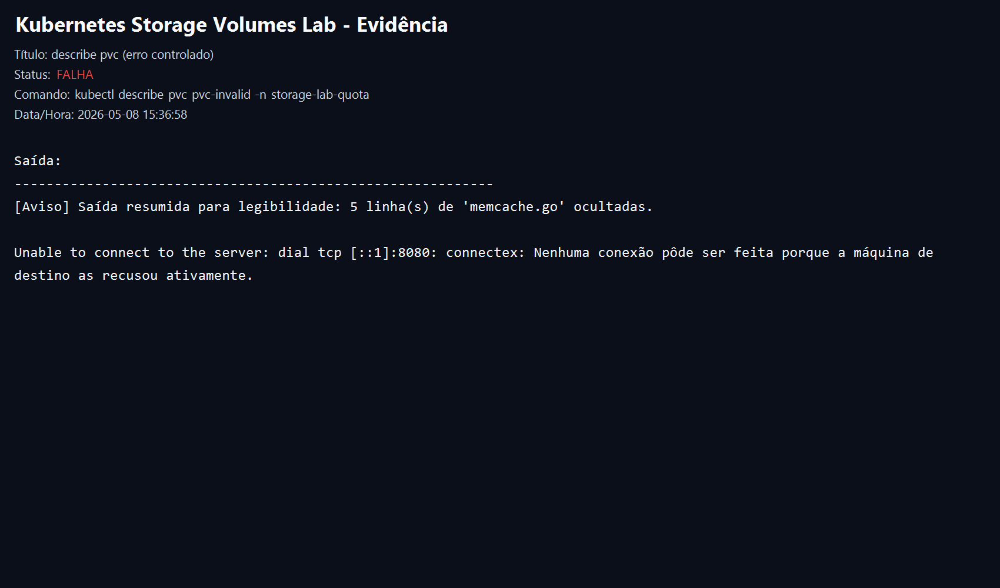](./screenshots/06-describe-pvc-error.png)

#### Contexto 5: Automação com PowerShell

Comandos de referência:

```powershell
.\scripts\apply-all.ps1
.\scripts\check-resources.ps1
.\scripts\cleanup-all.ps1
```

[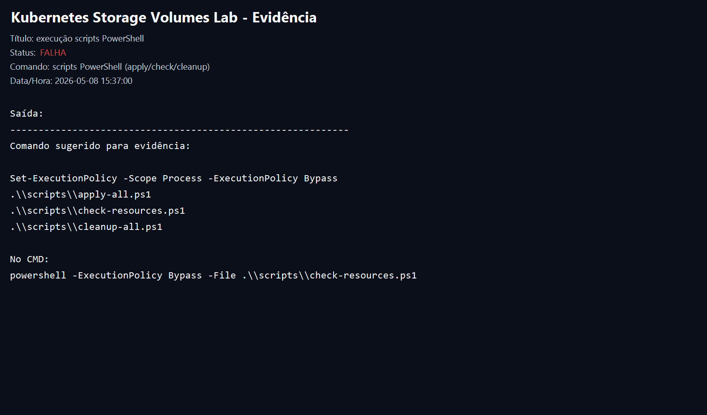](./screenshots/12-scripts-apply-check-cleanup.png)

## Como publicar este projeto no GitHub

Os comandos abaixo são compatíveis com **Windows 11** em **CMD** ou **PowerShell**.

### Opção A: Repositório já criado no GitHub

```powershell
git init
git status
git add .
git commit -m "docs: create kubernetes storage volumes lab"
git branch -M main
git remote add origin https://github.com/brodyandre/kubernetes-storage-volumes-lab.git
git remote -v
git push -u origin main
```

### Opção B: Repositório ainda não criado

Crie o repositório manualmente no GitHub com os seguintes dados:

- Nome: `kubernetes-storage-volumes-lab`
- Descrição: `Projeto prático de Kubernetes Storage no Windows 11 com k3d, demonstrando Volume, PV, PVC, StorageClass, HostPath, NFS, LimitRange, ResourceQuota, ConfigMap e Secret como volumes.`
- Visibilidade: `Public`

Depois de criar o repositório vazio no GitHub, execute os comandos da **Opção A**.

### Comandos úteis depois do primeiro push

```powershell
git status
git log --oneline
git remote -v
git add .
git commit -m "docs: update project documentation"
git push
```

## Habilidades demonstradas

- Kubernetes Storage
- Volumes
- PersistentVolume
- PersistentVolumeClaim
- StorageClass
- Provisionamento dinâmico
- hostPath
- NFS
- LimitRange
- ResourceQuota
- ConfigMap como volume
- Secret como volume
- kubectl
- k3d
- Docker Desktop
- Automação com PowerShell
- Documentação técnica para portfólio
- Boas práticas de organização de repositório

## Conclusão

Este projeto demonstra capacidade prática de projetar, aplicar e validar soluções de storage no Kubernetes em ambiente local Windows 11, cobrindo persistência, compartilhamento, automação com PowerShell e governança de recursos.  
É um material técnico sólido para portfólio GitHub e preparação para cenários reais.
