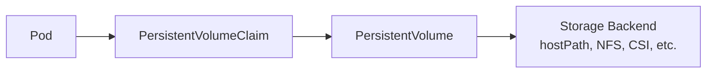
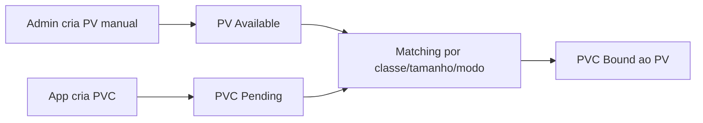

# 01 - Conceitos de Storage no Kubernetes

## Objetivo

Este documento apresenta os fundamentos de armazenamento no Kubernetes para apoiar os laboratórios práticos deste repositório.

Contexto do projeto:

- Windows 11
- VS Code
- PowerShell
- Docker Desktop
- k3d (`k3d-meucluster`)
- kubectl

## Visão Geral

Em Kubernetes, aplicações em Pods quase sempre precisam de um lugar para ler e gravar dados. Esse armazenamento pode ser:

- temporário (vive enquanto o Pod existe);
- persistente (sobrevive à recriação do Pod).

## Mapa rápido dos conceitos

| Conceito | Papel |
|---|---|
| `Volume` | Armazenamento montado no Pod |
| `emptyDir` | Temporário e vinculado ao ciclo de vida do Pod |
| `hostPath` | Diretório do nó montado no container |
| `PV/PVC` | Persistência desacoplada da aplicação |
| `StorageClass` | Provisionamento dinâmico de volumes |
| `LimitRange/ResourceQuota` | Governança de consumo |
| `ConfigMap/Secret` | Configuração e segredo como arquivo ou env |

## Volume

`Volume` é a definição de um recurso de armazenamento dentro do `spec` do Pod.

- Fica em `spec.volumes`.
- Pode ser montado em um ou mais containers do mesmo Pod.
- O tipo do volume define o comportamento (`emptyDir`, `hostPath`, PVC etc.).

### Diferença entre `volumes` e `volumeMounts`

- `volumes`: define **o que** será montado (fonte do armazenamento).
- `volumeMounts`: define **onde** o volume aparece dentro do container.

Exemplo didático:

```yaml
apiVersion: v1
kind: Pod
metadata:
  name: exemplo
spec:
  containers:
    - name: app
      image: busybox
      command: ["sh", "-c", "sleep 3600"]
      volumeMounts:
        - name: dados
          mountPath: /data
  volumes:
    - name: dados
      emptyDir: {}
```

## emptyDir

`emptyDir` é um volume temporário:

- é criado quando o Pod é agendado no nó;
- começa vazio;
- pode ser compartilhado entre containers do mesmo Pod;
- é apagado quando o Pod é removido do nó.

Uso comum:

- cache;
- arquivos temporários;
- troca de arquivos entre sidecars e container principal.

## hostPath

`hostPath` monta um caminho do filesystem do nó Kubernetes dentro do container.

Exemplo didático:

```yaml
volumes:
  - name: host-data
    hostPath:
      path: /tmp/k8s-hostpath-demo
      type: DirectoryOrCreate
```

### Observação importante para Windows 11

Mesmo usando Windows 11, o nó Kubernetes local normalmente roda Linux interno (por exemplo, no k3d/k3s executando em containers Docker).  
Por isso, caminhos como `/tmp/k8s-hostpath-demo` pertencem ao nó Linux interno do cluster, não diretamente ao `C:\` do Windows.

## PersistentVolume (PV)

`PersistentVolume` é um recurso do cluster que representa capacidade de armazenamento disponível para uso.

Características:

- escopo de cluster (não é namespaced);
- define capacidade (`capacity.storage`);
- define modo de acesso (`accessModes`);
- define política de descarte (`persistentVolumeReclaimPolicy`);
- pode ter classe (`storageClassName`).

## PersistentVolumeClaim (PVC)

`PersistentVolumeClaim` é o pedido de armazenamento feito pela aplicação.

Características:

- escopo de namespace;
- pede tamanho de storage;
- pede modo de acesso;
- pode pedir uma classe específica.

## Relação entre Pod, PVC e PV



Resumo:

- Pod não "aponta direto" para storage físico.
- Pod usa PVC.
- PVC se vincula a um PV compatível.

## StorageClass

`StorageClass` define como volumes devem ser provisionados (provisioner, parâmetros, reclaim policy etc.).

É a base para provisionamento dinâmico.

## Provisionamento Estático

No provisionamento estático:

1. Administrador cria PV manualmente.
2. Aplicação cria PVC.
3. Kubernetes faz o bind entre PVC e PV compatíveis.



Exemplo curto (didático):

```yaml
apiVersion: v1
kind: PersistentVolume
metadata:
  name: pv-demo
spec:
  capacity:
    storage: 1Gi
  accessModes: ["ReadWriteOnce"]
  storageClassName: manual
  hostPath:
    path: /tmp/k8s-pv-demo
---
apiVersion: v1
kind: PersistentVolumeClaim
metadata:
  name: pvc-demo
spec:
  accessModes: ["ReadWriteOnce"]
  storageClassName: manual
  resources:
    requests:
      storage: 500Mi
```

## Provisionamento Dinâmico

No provisionamento dinâmico:

1. Aplicação cria PVC.
2. PVC referencia um `StorageClass`.
3. Provisioner cria PV automaticamente.
4. PVC fica `Bound`.


Exemplo curto (didático):

```yaml
apiVersion: v1
kind: PersistentVolumeClaim
metadata:
  name: pvc-dinamico
spec:
  storageClassName: local-path
  accessModes: ["ReadWriteOnce"]
  resources:
    requests:
      storage: 1Gi
```

## AccessModes

Os modos de acesso principais são:

- `ReadWriteOnce` (RWO): leitura/escrita por um único nó.
- `ReadOnlyMany` (ROX): leitura por vários nós.
- `ReadWriteMany` (RWX): leitura/escrita por vários nós.

Importante:

- suporte real depende do backend (ex.: `hostPath` normalmente só atende RWO);
- AccessMode é usado para compatibilidade de bind entre PV e PVC.

## ReclaimPolicy

A `persistentVolumeReclaimPolicy` define o que acontece com o volume quando o PVC é removido:

- `Retain`: mantém os dados e o PV para tratamento manual.
- `Delete`: remove o PV e o storage associado (quando suportado pelo provisioner).
- `Recycle`: política legada/depreciada; fazia limpeza simples (`rm -rf`) e não é recomendada para novos ambientes.

## Capacidade de armazenamento

A capacidade é declarada em unidades como `Mi` e `Gi`.

- No PV: capacidade total ofertada.
- No PVC: capacidade solicitada.
- Para bind, o PV precisa ter capacidade igual ou maior que a solicitação do PVC.

## Montagem do volume no Pod

Para usar o volume no container:

1. Defina a fonte em `spec.volumes`.
2. Monte em `spec.containers[].volumeMounts`.

Exemplo didático com PVC:

```yaml
apiVersion: v1
kind: Pod
metadata:
  name: app-pvc
spec:
  containers:
    - name: app
      image: busybox
      command: ["sh", "-c", "sleep 3600"]
      volumeMounts:
        - name: app-data
          mountPath: /data
  volumes:
    - name: app-data
      persistentVolumeClaim:
        claimName: pvc-demo
```

## ConfigMap: variável de ambiente vs volume

`ConfigMap` guarda configuração não sensível.

- Como variável de ambiente:
  - simples para chaves pequenas;
  - valor fica em `env`;
  - mudanças normalmente exigem restart do Pod para refletir em env.
- Como volume:
  - cada chave vira arquivo;
  - útil para apps que leem arquivo de config;
  - estrutura mais organizada para múltiplas chaves.

Exemplo curto:

```yaml
# env
env:
  - name: APP_MODE
    valueFrom:
      configMapKeyRef:
        name: app-config
        key: mode

# volume
volumes:
  - name: config-vol
    configMap:
      name: app-config
```

## Secret: variável de ambiente vs volume

`Secret` é para dados sensíveis (senhas, tokens, chaves).

- Como variável de ambiente:
  - prático para bibliotecas que usam env;
  - pode aparecer com mais facilidade em dumps/process list.
- Como volume:
  - segredo vira arquivo no container;
  - facilita controle de permissões de arquivo;
  - geralmente é a abordagem preferida para reduzir exposição.

Exemplo curto:

```yaml
# env
env:
  - name: DB_PASSWORD
    valueFrom:
      secretKeyRef:
        name: db-secret
        key: password

# volume
volumes:
  - name: secret-vol
    secret:
      secretName: db-secret
```

## Conclusão

Para dominar storage no Kubernetes, pense em três camadas:

1. como o Pod monta (`volumes` + `volumeMounts`);
2. como o armazenamento é solicitado (PVC);
3. como o armazenamento é entregue (PV estático ou via StorageClass dinâmica).

Com essa base, os próximos laboratórios ficam mais objetivos e previsíveis.
