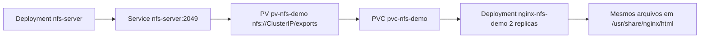

# 04 - NFS Storage em ambiente local Kubernetes

## 1. Explicação conceitual

`NFS` (Network File System) permite que múltiplos Pods montem o mesmo diretório remoto simultaneamente.

No Kubernetes, isso é útil para cenários com `ReadWriteMany (RWX)`, onde várias réplicas precisam ler/gravar no mesmo volume.

Neste projeto:

- o cluster alvo é `k3d-meucluster` (k3s em containers Docker);
- o servidor NFS roda dentro do próprio cluster local (`manifests/04-nfs-server`);
- o consumo acontece com PV/PVC NFS (`manifests/05-nfs-volume`).

### Tabela rápida

| Item | Exemplo neste projeto |
|---|---|
| Servidor NFS | `deployment/nfs-server` |
| Service NFS | `service/nfs-server` |
| PV NFS | `pv-nfs-demo` |
| PVC NFS | `pvc-nfs-demo` |
| AccessMode | `ReadWriteMany` |

## 2. Quando usar

- compartilhamento de arquivos entre réplicas;
- conteúdo comum para múltiplos Pods (ex.: assets, arquivos estáticos);
- laboratório para entender `ReadWriteMany`.

## 3. Quando evitar

- workloads críticos sem alta disponibilidade de storage;
- cenários de alto throughput/baixa latência que exigem storage especializado;
- produção sem controles robustos de segurança e backup.

## 4. Exemplo prático

Fluxo dos labs 04 e 05:

1. Criar Deployment `nfs-server` e Service `nfs-server` em `storage-lab`.
2. Obter o `ClusterIP` do Service NFS.
3. Criar PV NFS (`pv-nfs-demo`) com `server: <ClusterIP>`, path `/exports` e `ReadWriteMany`.
4. Criar PVC `pvc-nfs-demo`.
5. Subir Deployment `nginx-nfs-demo` com 2 réplicas compartilhando o PVC.

Observação Windows 11: você não precisa instalar servidor NFS no Windows. Todo o cenário é interno ao cluster local.

## 5. Diagrama Mermaid



## 6. Comandos kubectl úteis (PowerShell)

```powershell
# 1) Subir servidor NFS
kubectl apply -f .\manifests\04-nfs-server
kubectl get pods -n storage-lab
kubectl get svc nfs-server -n storage-lab
kubectl describe svc nfs-server -n storage-lab

# 2) Gerar PV NFS com ClusterIP automaticamente (opção recomendada)
Set-ExecutionPolicy -Scope Process -ExecutionPolicy Bypass
.\scripts\prepare-nfs-pv.ps1
kubectl apply -f .\manifests\05-nfs-volume\persistent-volume-nfs.generated.yaml

# 3) Aplicar PVC + app
kubectl apply -f .\manifests\05-nfs-volume\persistent-volume-claim-nfs.yaml
kubectl apply -f .\manifests\05-nfs-volume\deployment-using-nfs-pvc.yaml
kubectl apply -f .\manifests\05-nfs-volume\service-nginx-nfs.yaml

# 4) Validar vínculo e pods
kubectl get pv
kubectl get pvc -n storage-lab
kubectl get pods -n storage-lab -l app=nginx-nfs-demo
```

Teste de compartilhamento entre réplicas:

```powershell
# Escolha dois pods diferentes do deployment
kubectl get pods -n storage-lab -l app=nginx-nfs-demo

# Escreva em um pod
kubectl exec -n storage-lab <POD_A> -- sh -c "echo '<h1>NFS OK</h1>' > /usr/share/nginx/html/index.html"

# Leia em outro pod
kubectl exec -n storage-lab <POD_B> -- cat /usr/share/nginx/html/index.html
```

## 7. Erros comuns e como resolver

- **`NFS_SERVER_CLUSTER_IP` não substituído**  
  Se o PV original com placeholder for aplicado, o mount falha. Gere e aplique `persistent-volume-nfs.generated.yaml`.

- **PVC não fica `Bound`**  
  Verifique se o PV NFS existe, se `storageClassName` confere (`nfs-manual`) e se `accessModes` são compatíveis.

- **Falha de mount NFS no Pod**  
  Use `kubectl describe pod -n storage-lab <pod>` e confira eventos de mount.

- **Servidor NFS indisponível**  
  Confira `kubectl logs -n storage-lab deployment/nfs-server` e status do Service.

- **Teste HTTP sem resposta**  
  Use `kubectl port-forward -n storage-lab svc/nginx-nfs-demo 8080:80` e depois `curl.exe http://127.0.0.1:8080`.

## 8. Resumo final

NFS é uma forma didática de demonstrar `ReadWriteMany` em Kubernetes local. Ele mostra claramente o conceito de volume compartilhado entre réplicas, mas requer cuidado em produção quanto a disponibilidade, segurança e performance.
