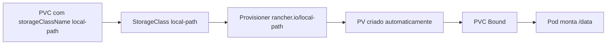

# 05 - StorageClass e Provisionamento Dinâmico

## 1. Explicação conceitual

`StorageClass` define *como* o cluster deve provisionar storage para um `PersistentVolumeClaim` (PVC).  
Quando o PVC referencia uma classe válida, o provisioner cria um `PersistentVolume` (PV) automaticamente.

No ambiente deste projeto:

- cluster: `k3d-meucluster` (k3s rodando em containers Docker);
- classe padrão esperada: `local-path`;
- provisioner esperado: `rancher.io/local-path`.

### Tabela rápida

| Item | Exemplo neste lab |
|---|---|
| PVC | `pvc-dynamic-demo` |
| Pod | `pod-dynamic-pvc-demo` |
| StorageClass | `local-path` |
| Tamanho solicitado | `500Mi` |
| Resultado esperado | PV criado automaticamente |

## 2. Quando usar

- quando você quer automatizar criação de volumes sem criar PV manual;
- quando deseja padronizar políticas de storage por classe;
- em ambientes locais e produtivos com provisioner CSI configurado.

## 3. Quando evitar

- quando precisa de controle manual de cada PV (use provisionamento estático);
- quando o cluster não possui provisioner funcional para a classe;
- quando o workload não precisa persistência.

## 4. Exemplo prático

No lab `manifests/06-storageclass`:

- `pvc-dynamic.yaml` cria `pvc-dynamic-demo` (`ReadWriteOnce`, `500Mi`, `storageClassName: local-path`);
- `pod-dynamic-pvc.yaml` monta o PVC em `/data` e grava `dynamic.txt`.

Fluxo esperado:

1. PVC criado;
2. provisioner `rancher.io/local-path` cria PV automaticamente;
3. PVC fica `Bound`;
4. Pod usa o volume.

## 5. Diagrama Mermaid



## 6. Comandos kubectl úteis (PowerShell)

```powershell
# Ver classes disponíveis
kubectl get storageclass

# Ver detalhes da classe usada neste projeto
kubectl describe storageclass local-path

# Aplicar o lab (pasta completa)
kubectl apply -f manifests/06-storageclass
kubectl get pvc -n storage-lab
kubectl get pv

# Ler arquivo criado no volume
kubectl exec -n storage-lab pod-dynamic-pvc-demo -- cat /data/dynamic.txt
```

## 7. Erros comuns e como resolver

- **`storageclass.storage.k8s.io "local-path" not found`**  
  Verifique se o contexto é `k3d-meucluster` com `kubectl config current-context`.

- **PVC fica `Pending`**  
  Confira events do PVC e status da StorageClass:  
  `kubectl describe pvc pvc-dynamic-demo -n storage-lab`  
  `kubectl describe storageclass local-path`

- **PV não aparece automaticamente**  
  O provisioner pode estar indisponível. Verifique se o cluster k3d está ativo e se `kubectl get nodes` retorna nós `Ready`.

- **Pod pendente com `WaitForFirstConsumer`**  
  Em algumas políticas, o volume só é provisionado após o Pod consumidor existir. Aplique o Pod e revalide.

- **Classe diferente em outro cluster local**  
  Em ambientes fora do k3d/k3s (como Minikube ou Kubernetes do Docker Desktop), o nome pode variar (`hostpath`, `standard`, `csi-hostpath-sc` etc.). Ajuste `storageClassName` conforme `kubectl get storageclass`.

## 8. Resumo final

Com StorageClass, o Kubernetes automatiza PVs e reduz operação manual.  
No cluster `k3d-meucluster`, o padrão é `local-path`, então o laboratório já está pronto para esse cenário no Windows 11 com PowerShell.
