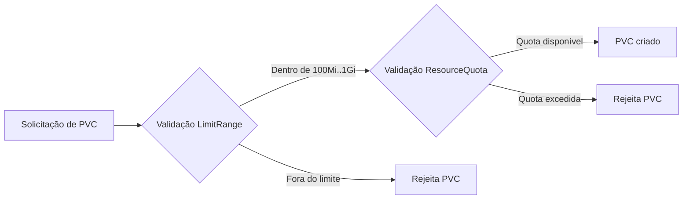

# 06 - LimitRange e ResourceQuota para Storage

## 1. Explicação conceitual

`LimitRange` e `ResourceQuota` ajudam a governar consumo de recursos no namespace:

- `LimitRange`: define limites por objeto (neste caso, por PVC), como mínimo e máximo;
- `ResourceQuota`: define teto agregado do namespace (total de storage e quantidade de PVCs).

### Tabela comparativa

| Política | Atua em | Exemplo no lab |
|---|---|---|
| `LimitRange` | Cada PVC individual | min 100Mi / max 1Gi |
| `ResourceQuota` | Soma total do namespace | `requests.storage: 2Gi` e `persistentvolumeclaims: 2` |

No laboratório `manifests/07-limitrange-resourcequota`:

- namespace: `storage-lab-quota`;
- `LimitRange`: mínimo 100Mi e máximo 1Gi por PVC;
- `ResourceQuota`: total `requests.storage` até 2Gi e até 2 PVCs.
- ambiente alvo: cluster `k3d-meucluster` com StorageClass `local-path`.

## 2. Quando usar

- clusters compartilhados por times/projetos;
- prevenção de consumo acidental excessivo;
- ambientes de estudo e produção que exigem previsibilidade.

## 3. Quando evitar

- ambientes muito pequenos em fase inicial de experimentação sem múltiplos usuários;
- quando limites foram definidos sem alinhamento com necessidades reais de aplicações.

Evitar não significa abandonar governança, mas sim ajustar limites para não bloquear workloads legítimos.

## 4. Exemplo prático

Arquivos principais:

- `limitrange-storage.yaml` (`storage-limit-range`);
- `resourcequota-storage.yaml` (`storage-resource-quota`);
- `pvc-valid.yaml` (500Mi, deve passar);
- `pvc-invalid.yaml` (2Gi, deve falhar pelo LimitRange);
- `pvc-quota-01.yaml` (1Gi, deve passar);
- `pvc-quota-02.yaml` (1Gi, deve passar);
- `pvc-quota-exceed.yaml` (500Mi, deve falhar por quota de PVCs/total).

## 5. Diagrama Mermaid



## 6. Comandos kubectl úteis (PowerShell)

```powershell
# 1) Namespace e políticas
kubectl apply -f .\manifests\07-limitrange-resourcequota\namespace.yaml
kubectl apply -f .\manifests\07-limitrange-resourcequota\limitrange-storage.yaml
kubectl apply -f .\manifests\07-limitrange-resourcequota\resourcequota-storage.yaml

# 2) Inspecionar políticas
kubectl describe limitrange storage-limit-range -n storage-lab-quota
kubectl describe resourcequota storage-resource-quota -n storage-lab-quota

# 3) Teste LimitRange
kubectl apply -f .\manifests\07-limitrange-resourcequota\pvc-valid.yaml
kubectl apply -f .\manifests\07-limitrange-resourcequota\pvc-invalid.yaml

# 4) Teste ResourceQuota
kubectl apply -f .\manifests\07-limitrange-resourcequota\pvc-quota-01.yaml
kubectl apply -f .\manifests\07-limitrange-resourcequota\pvc-quota-02.yaml
kubectl apply -f .\manifests\07-limitrange-resourcequota\pvc-quota-exceed.yaml

# 5) Estado final
kubectl get pvc -n storage-lab-quota
kubectl get resourcequota -n storage-lab-quota
kubectl describe resourcequota -n storage-lab-quota
```

## 7. Erros comuns e como resolver

- **PVC rejeitado por tamanho**  
  Exemplo esperado: `pvc-invalid` solicita 2Gi e deve falhar pelo `LimitRange` (máximo 1Gi).

- **PVC rejeitado por quota de quantidade**  
  Após dois PVCs aceitos, o terceiro pode falhar por limite `persistentvolumeclaims: "2"`.

- **PVC rejeitado por quota de storage total**  
  Se a soma de `requests.storage` passar de 2Gi, novos PVCs serão negados.

- **Interpretação incorreta de erro**  
  Sempre use `kubectl describe` no PVC e na quota para identificar se a causa foi `LimitRange` ou `ResourceQuota`.

- **Diferenças de comportamento local**  
  No cluster `k3d-meucluster`, o provisionamento depende da StorageClass `local-path`. Se não houver PV/PVC `Bound`, verifique StorageClass e provisioner antes de concluir que a quota está incorreta.

## 8. Resumo final

`LimitRange` controla o tamanho por PVC; `ResourceQuota` controla o consumo total do namespace. Juntos, eles evitam desperdício e aumentam previsibilidade operacional em ambientes compartilhados.
