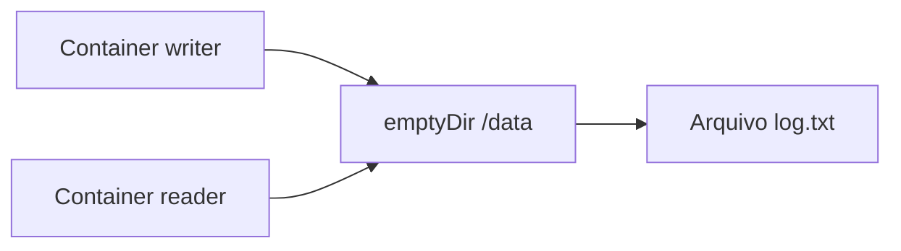

# Laboratório 01 - Volume `emptyDir`

## Objetivo

Demonstrar volume temporário no Kubernetes com dois containers no mesmo Pod compartilhando dados em tempo real.

## Arquivos

- `namespace.yaml`
- `pod-emptydir.yaml`

## Conceitos-chave

| Conceito | Aplicação neste laboratório |
|---|---|
| `Volume` | Define armazenamento compartilhado no Pod |
| `emptyDir` | Volume temporário criado junto com o Pod |
| Multi-container Pod | `writer` e `reader` acessam o mesmo caminho `/data` |

## Arquitetura lógica



## Como funciona

- Container `writer` grava continuamente data/hora em `/data/log.txt`.
- Container `reader` lê continuamente o conteúdo de `/data/log.txt`.
- O volume `emptyDir` existe enquanto o Pod existir no nó.

## Execução no PowerShell

```powershell
cd .\manifests\01-volume-emptydir
kubectl apply -f .
kubectl get pods -n storage-lab
```

## Validação

```powershell
kubectl logs -n storage-lab pod/emptydir-demo -c writer
kubectl logs -n storage-lab pod/emptydir-demo -c reader
```

## Limpeza

```powershell
kubectl delete -f .
```

## Troubleshooting

- `Pod Pending`: execute `kubectl describe pod emptydir-demo -n storage-lab`.
- `reader` sem conteúdo: aguarde alguns segundos e consulte logs do `writer`.
- Erro de namespace: confirme se `storage-lab` foi criado.

## Evidências recomendadas

- `kubectl get pods -n storage-lab`
- logs de `writer` mostrando escrita contínua
- logs de `reader` mostrando leitura do mesmo arquivo
