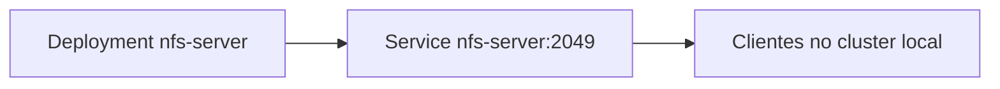

# Laboratório 04 - Servidor NFS no Kubernetes local

## Objetivo

Provisionar um servidor NFS simples dentro do cluster Kubernetes local para uso didático nos laboratórios seguintes.

## Arquivos

- `namespace.yaml`
- `nfs-server-deployment.yaml`
- `nfs-server-service.yaml`

## Conceitos-chave

| Conceito | Aplicação neste laboratório |
|---|---|
| NFS | Compartilhamento de arquivos em rede |
| `ReadWriteMany` | Backend comum para múltiplas réplicas |
| Service `ClusterIP` | Endpoint interno para clientes NFS no cluster |

## Observação importante (Windows 11)

O servidor NFS roda dentro do cluster local.  
Não é necessário instalar serviço NFS diretamente no Windows para executar este laboratório.

## Arquitetura lógica



## Execução no PowerShell

```powershell
cd .\manifests\04-nfs-server
kubectl apply -f .
```

## Validação

```powershell
kubectl get pods -n storage-lab
kubectl get svc -n storage-lab
kubectl describe svc nfs-server -n storage-lab
kubectl logs -n storage-lab deployment/nfs-server
```

Obter `ClusterIP`:

```powershell
kubectl get svc nfs-server -n storage-lab -o jsonpath="{.spec.clusterIP}"
```

## Limitações desta abordagem local

- é um cenário de estudo, não de produção;
- o volume do servidor NFS usa `emptyDir` (dados não persistem se o Pod for recriado);
- o container NFS usa modo privilegiado para simplificar demonstração.

## Limpeza

```powershell
kubectl delete -f .
```

## Troubleshooting

- Deployment não sobe: valide eventos com `kubectl describe deployment nfs-server -n storage-lab`.
- Service sem endpoint: confira se o Pod `nfs-server` está `Running`.
- Falha em labs seguintes: confirme que o `ClusterIP` foi usado corretamente no PV NFS.

## Evidências recomendadas

- `kubectl get pods -n storage-lab`
- `kubectl get svc nfs-server -n storage-lab`
- `kubectl describe svc nfs-server -n storage-lab`
