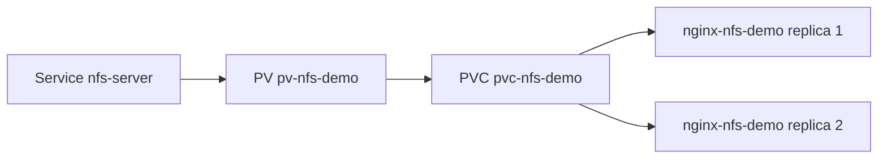

# Laboratório 05 - PV/PVC com NFS (`ReadWriteMany`)

## Objetivo

Demonstrar `PersistentVolume` e `PersistentVolumeClaim` usando backend NFS para compartilhar dados entre duas réplicas NGINX.

## Arquivos

- `persistent-volume-nfs.yaml` (template com placeholder)
- `persistent-volume-claim-nfs.yaml`
- `deployment-using-nfs-pvc.yaml`
- `service-nginx-nfs.yaml`

## Cenário

| Recurso | Nome | Configuração |
|---|---|---|
| PV | `pv-nfs-demo` | 1Gi, `ReadWriteMany`, `nfs-manual` |
| PVC | `pvc-nfs-demo` | 500Mi, `ReadWriteMany` |
| Deployment | `nginx-nfs-demo` | 2 réplicas, volume em `/usr/share/nginx/html` |
| Service | `nginx-nfs-demo` | `ClusterIP` porta 80 |

Namespace: `storage-lab`.

## Observação importante (Windows 11)

O servidor NFS é executado no cluster local (`manifests/04-nfs-server`).  
Não há dependência de NFS instalado diretamente no Windows.

## Arquitetura lógica



## Descobrir o ClusterIP do NFS

```powershell
kubectl get svc nfs-server -n storage-lab
kubectl get svc nfs-server -n storage-lab -o jsonpath="{.spec.clusterIP}"
```

## Opção A - Substituição manual do placeholder

1. Edite `persistent-volume-nfs.yaml`.
2. Substitua:

```yaml
server: NFS_SERVER_CLUSTER_IP
```

3. Aplique:

```powershell
kubectl apply -f manifests/05-nfs-volume/persistent-volume-nfs.yaml
kubectl apply -f manifests/05-nfs-volume/persistent-volume-claim-nfs.yaml
kubectl apply -f manifests/05-nfs-volume/deployment-using-nfs-pvc.yaml
kubectl apply -f manifests/05-nfs-volume/service-nginx-nfs.yaml
```

## Opção B - Script PowerShell (recomendado)

```powershell
Set-ExecutionPolicy -Scope Process -ExecutionPolicy Bypass
.\scripts\prepare-nfs-pv.ps1
kubectl apply -f manifests/05-nfs-volume/persistent-volume-nfs.generated.yaml
kubectl apply -f manifests/05-nfs-volume/persistent-volume-claim-nfs.yaml
kubectl apply -f manifests/05-nfs-volume/deployment-using-nfs-pvc.yaml
kubectl apply -f manifests/05-nfs-volume/service-nginx-nfs.yaml
```

## Validação

```powershell
kubectl get pv
kubectl get pvc -n storage-lab
kubectl get pods -n storage-lab -l app=nginx-nfs-demo
```

Teste de compartilhamento entre réplicas:

```powershell
$pods = kubectl get pods -n storage-lab -l app=nginx-nfs-demo -o jsonpath="{.items[*].metadata.name}"
$podList = $pods -split " "
$podA = $podList[0]
$podB = $podList[1]

kubectl exec -n storage-lab $podA -- sh -c "echo '<h1>Conteudo compartilhado via NFS</h1>' > /usr/share/nginx/html/index.html"
kubectl exec -n storage-lab $podB -- cat /usr/share/nginx/html/index.html
```

Teste HTTP:

```powershell
kubectl port-forward -n storage-lab svc/nginx-nfs-demo 8080:80
curl.exe http://127.0.0.1:8080
```

## Diferença `ReadWriteOnce` vs `ReadWriteMany`

- `ReadWriteOnce`: leitura/escrita por um nó por vez.
- `ReadWriteMany`: leitura/escrita compartilhada por múltiplos consumidores (quando backend suporta).

## Limpeza

```powershell
kubectl delete -f manifests/05-nfs-volume/service-nginx-nfs.yaml --ignore-not-found
kubectl delete -f manifests/05-nfs-volume/deployment-using-nfs-pvc.yaml --ignore-not-found
kubectl delete -f manifests/05-nfs-volume/persistent-volume-claim-nfs.yaml --ignore-not-found
kubectl delete -f manifests/05-nfs-volume/persistent-volume-nfs.generated.yaml --ignore-not-found
kubectl delete -f manifests/05-nfs-volume/persistent-volume-nfs.yaml --ignore-not-found
```

## Troubleshooting

- PVC não fica `Bound`: valide `storageClassName: nfs-manual`, `accessModes` e IP do NFS.
- Pod falha no mount: use `kubectl describe pod -n storage-lab <pod>`.
- `prepare-nfs-pv.ps1` falha: confirme se o lab 04 foi aplicado.

## Evidências recomendadas

- `kubectl get pv`
- `kubectl get pvc -n storage-lab`
- saída de `cat /usr/share/nginx/html/index.html` em duas réplicas
- teste HTTP via `curl.exe`
