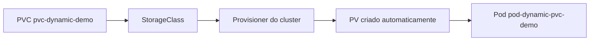

# Laboratório 06 - StorageClass e provisionamento dinâmico

## Objetivo

Demonstrar criação automática de `PersistentVolume` a partir de um `PersistentVolumeClaim` com `StorageClass`.

## Arquivos

- `storageclass-standard-info.md` (nota didática da classe `local-path` no k3d)
- `pvc-dynamic.yaml`
- `pod-dynamic-pvc.yaml`

## Conceitos-chave

| Conceito | Aplicação neste laboratório |
|---|---|
| `StorageClass` | Perfil de provisionamento de volume |
| Provisionamento dinâmico | PV criado automaticamente ao criar PVC |
| PVC | `pvc-dynamic-demo` solicitando 500Mi |
| Pod consumidor | `pod-dynamic-pvc-demo` monta PVC em `/data` |

Namespace: `storage-lab`.

## Observação importante (Windows 11)

No ambiente alvo deste projeto (`k3d-meucluster`), a classe esperada é `local-path` com provisioner `rancher.io/local-path`.

Observação: o manifesto deste lab já está configurado para `storageClassName: local-path`.

Em outros ambientes locais (por exemplo, Minikube ou Kubernetes do Docker Desktop), o nome da StorageClass padrão pode variar.  
Neste projeto, validado com k3d/k3s, o nome correto é `local-path`.

## Arquitetura lógica



## Execução no PowerShell

```powershell
kubectl get storageclass
kubectl describe storageclass local-path
kubectl apply -f manifests/06-storageclass
kubectl get pvc -n storage-lab
kubectl get pv
```

## Validação

```powershell
kubectl exec -n storage-lab pod-dynamic-pvc-demo -- cat /data/dynamic.txt
```

## Limpeza

```powershell
kubectl delete -f pod-dynamic-pvc.yaml --ignore-not-found
kubectl delete -f pvc-dynamic.yaml --ignore-not-found
```

## Troubleshooting

- `storageclass "local-path" not found`: confirme que o contexto é `k3d-meucluster` e valide `kubectl get storageclass`.
- PVC em `Pending`: provisioner pode estar indisponível ou classe incorreta.
- Pod pendente: confirme se PVC chegou a `Bound`.

## Evidências recomendadas

- `kubectl get storageclass`
- `kubectl get pvc -n storage-lab`
- `kubectl get pv` mostrando PV criado automaticamente
- leitura de `/data/dynamic.txt`
