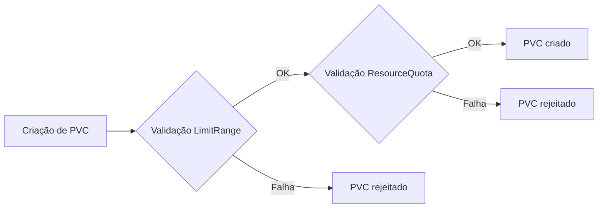

# Laboratório 07 - `LimitRange` e `ResourceQuota` para PVC

## Objetivo

Demonstrar governança de consumo de storage no namespace com:

- `LimitRange` (mínimo/máximo por PVC)
- `ResourceQuota` (limite total de storage e quantidade de PVCs)

## Arquivos

- `namespace.yaml`
- `limitrange-storage.yaml`
- `resourcequota-storage.yaml`
- `pvc-valid.yaml`
- `pvc-invalid.yaml` (falha proposital)
- `pvc-quota-01.yaml`
- `pvc-quota-02.yaml`
- `pvc-quota-exceed.yaml` (falha proposital)

Namespace: `storage-lab-quota`.

## Conceitos-chave

| Política | Regra neste laboratório |
|---|---|
| `LimitRange` | mínimo 100Mi e máximo 1Gi por PVC |
| `ResourceQuota` | `requests.storage` total até 2Gi |
| `ResourceQuota` | até 2 PVCs no namespace |

## Arquitetura lógica



## Execução no PowerShell

1) Aplicar namespace e políticas:

```powershell
cd .\manifests\07-limitrange-resourcequota
kubectl apply -f namespace.yaml
kubectl apply -f limitrange-storage.yaml
kubectl apply -f resourcequota-storage.yaml
```

2) Inspecionar:

```powershell
kubectl describe limitrange storage-limit-range -n storage-lab-quota
kubectl describe resourcequota storage-resource-quota -n storage-lab-quota
```

## Teste A - LimitRange

```powershell
kubectl apply -f pvc-valid.yaml
kubectl apply -f pvc-invalid.yaml
kubectl get pvc -n storage-lab-quota
```

`pvc-invalid` deve falhar propositalmente (solicita 2Gi, acima de 1Gi).

## Teste B - ResourceQuota

Opcional: limpar PVCs anteriores do teste A para um cenário controlado.

```powershell
kubectl delete -f pvc-valid.yaml --ignore-not-found
kubectl delete -f pvc-invalid.yaml --ignore-not-found
```

Aplicar consumo de quota:

```powershell
kubectl apply -f pvc-quota-01.yaml
kubectl apply -f pvc-quota-02.yaml
kubectl apply -f pvc-quota-exceed.yaml
```

`pvc-quota-exceed` deve falhar propositalmente por exceder número de PVCs e/ou storage total.

## Ver consumo atual da quota

```powershell
kubectl get resourcequota -n storage-lab-quota
kubectl describe resourcequota -n storage-lab-quota
kubectl get pvc -n storage-lab-quota
```

## Limpeza

```powershell
kubectl delete -f pvc-quota-exceed.yaml --ignore-not-found
kubectl delete -f pvc-quota-02.yaml --ignore-not-found
kubectl delete -f pvc-quota-01.yaml --ignore-not-found
kubectl delete -f pvc-invalid.yaml --ignore-not-found
kubectl delete -f pvc-valid.yaml --ignore-not-found
kubectl delete -f resourcequota-storage.yaml --ignore-not-found
kubectl delete -f limitrange-storage.yaml --ignore-not-found
kubectl delete -f namespace.yaml --ignore-not-found
```

## Troubleshooting

- PVC não cria mesmo sendo válido: verifique StorageClass padrão do cluster local.
- Erro inesperado de quota: inspecione `kubectl describe resourcequota -n storage-lab-quota`.
- Dúvida na causa da falha: confira eventos do PVC com `kubectl describe pvc <nome> -n storage-lab-quota`.

## Evidências recomendadas

- `kubectl describe limitrange storage-limit-range -n storage-lab-quota`
- `kubectl describe resourcequota storage-resource-quota -n storage-lab-quota`
- erro controlado de `pvc-invalid`
- erro controlado de `pvc-quota-exceed`
